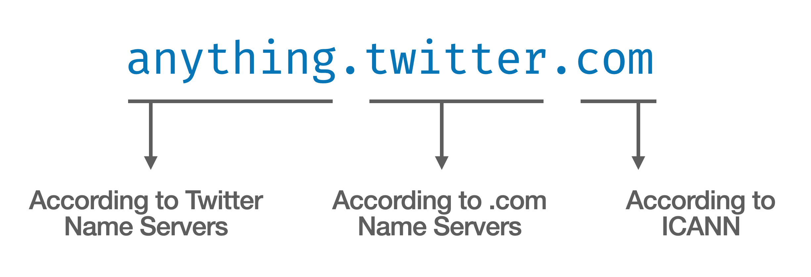
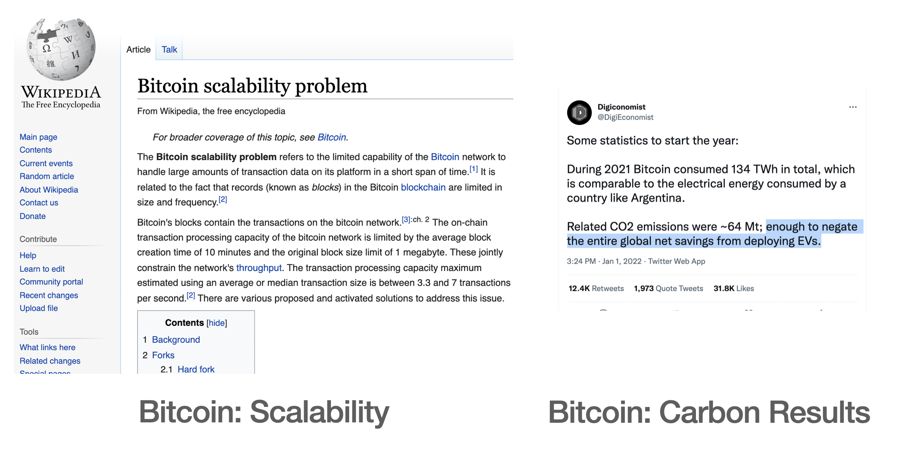
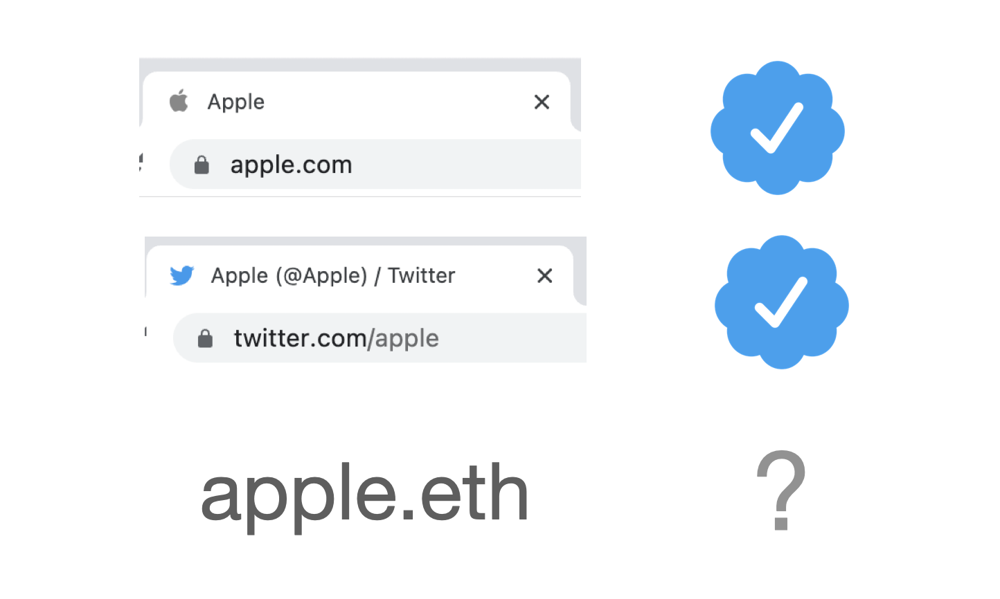
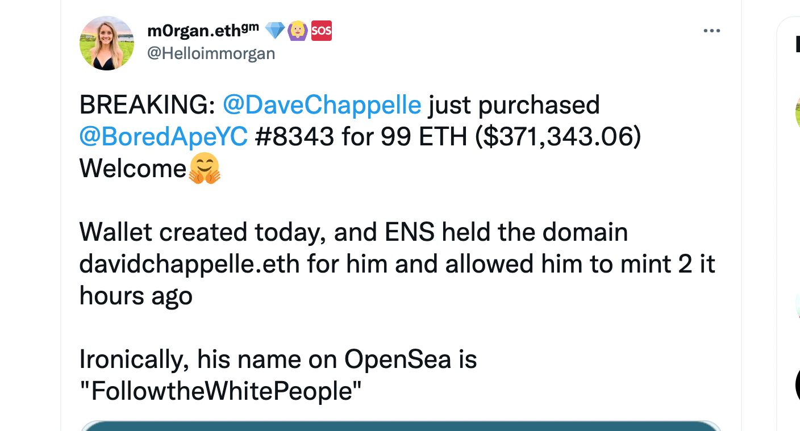
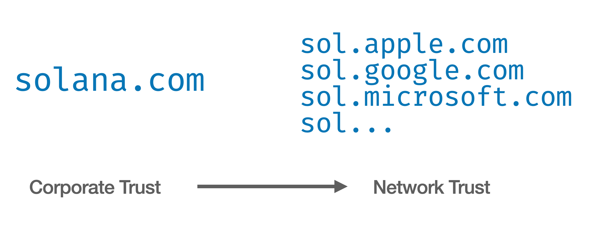
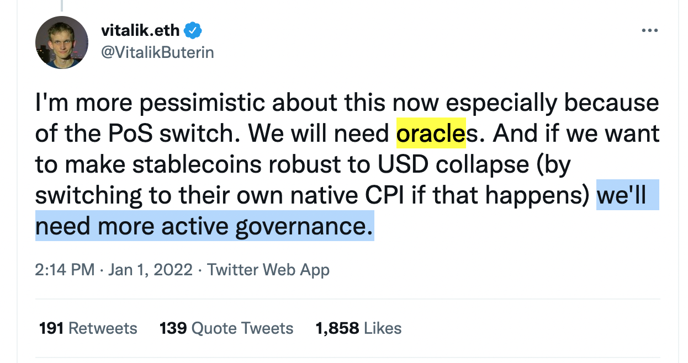

I'm code(Eric), and I want to build a more ethical version of the web. The web operates on distributed systems of trust. Sadly, a majority of the current web3 conversation is focused on trustless networks like Ethereum. But I believe the next successful generation of the web will build upon our existing web of trust to reach new heights.

## Our Distributed Trust Today

First let's talk about the systems of trust we already depend on, like domain names. Domain name infrastructure is not *decentralized*, because everything rolls up to a central authority. But the domain name system is widely *distributed*, both geographically and organizationally. Every country has their own top-level domain, and many generic top-level domains exist for anybody to use.

Once you register a domain name via a registrar, your name server has control of all of the "subdomains" under it. Take Twitter's domain for example:

You can assume that `anything.twitter.com` is a trusted part of the Twitter company. This works because:

- ICANN, the regulating body for domain names, delegates authority to top-level name servers such as `.com`
- The `.com` name servers have a record for `twitter`
- The name servers controlled by `Twitter, Inc` have an entry for the `anything` server

This model of delegated trust allows anybody to own a name on the internet, and use it without restriction.

There are other systems involved as well. A domain only refers to an IP address, so you rely on your Internet Service Provider (ISP) to connect you properly. The ISPs connect to each-other via a system of trust called BGP routing. This is a negotiation of IP address ranges, in order to ensure that your packets are sent to the right server. Once connected to your server, we use additional layers of security like HTTPS(TLS) or SSH, which are higher-level systems of trust. These involve technologies like public key cryptography, certificate chaining, shared-key encryption, and sessions.

These systems are imperfect for a number of reasons, but it is the best system of distributed digital trust that has reached mainstream adoption. The next generation of reputable systems will _have_ to be built on top of this current web of trust.

## Dawn of the Trustless network

In 2009, Satoshi Nakamoto launched Bitcoin, which uses Proof-of-Work to create trustless consensus on a ledger. Despite the built-in performance limitations and impact on the environment, Nakamoto Consensus is a brilliant invention.

A trustless network like Bitcoin allows anybody to participate without necessarily revealing their identity to any party. Proof-of-Work accomplishes this by wasting energy on computations that are otherwise useless- it is inherently wasteful, to ensure pseudononymity of users on the network, and to provide an incentive model to keep the network online.

For those who lack access to banking, crypto-currency on a trustless network is _can_ be incredibly useful. Unfortunately, Bitcoin and Ethereum have expensive and volatile transaction fees, so they are impractical for the underbanked.

Bitcoin Cash was forked from the Bitcoin network to become a more practical currency, and it may be the most useful cryptocurrency right now, with a transaction fee around $.01. With a maximum of ~115 transactions/sec, it dramatically outpaces Bitcoin's 7 TPS. The BitcoinCash network currently consumes an [estimated 97% less energy than Bitcon](https://www.trgdatacenters.com/most-environment-friendly-cryptocurrencies/).

Proof-of-Work builds upon several powerful crypto inventions that can be used in trusted systems to enable robust verification and transparency, without wasting incredible amounts of energy. A few such example technologies are: public key cryptography, content addressability, merkle trees, and blockchains.

Since Bitcoin, Ethereum has risen as the de-facto "smartchain", which is more of a computer than a currency, capable of running generic code in a trustless fashion. With "smart contracts", it is possible to create trustworthy programs that handle money. The DAO may be the first type of human organization that is more resilient than companies and governments.

## Building Trust on Trustless networks

If you do want to adopt trustless networks, it is possible to move your reputation. ENS is a reliable system on Ethereum for adding a label to a public key.

These labels are available to everybody. If somebody owns `apple.eth`, I would assume they are a speculative fruit investor. But if Apple.com and/or the Apple Twitter account claimed to be `apple.eth`, then I would trust it as a form of identity. Eventually they may get hacked so I would remain subscribed to the trusted channels.

By itself, ENS is a terrible form of trust. The other day, an ENS address called "Dave Chapelle" bought a Bored Ape NFT for over $300k. But we have no evidence this is is the actual TERF comedian.

If Chappelle tweets about this ownership, we would probably believe him. Although, [he hasn't tweeted since 2012](https://twitter.com/davechappelle), and Twitter accounts are occasionally hacked. Even after his death, [Stan Lee's account was hacked](https://www.reddit.com/r/CryptoCurrency/comments/rhhthd/stan_lees_twitter_account_is_being_used_to/) for a crypto scam.

Even once identity is confirmed on a trustless network, it is quite fragile. If somebody looses their keys, they loose access to their money, data, and identity. If keys are stolen, your assets (including your name) can be taken and there is absolutely nothing you can do to recover them. And keep in mind, it is a lot harder to use your keys when you are keeping them safe in cold storage. In comparison, domain names are recoverable, if you forget the password to your registrar or name servers.

## Quasi-Centralization

Since Bitcoin and Ethereum, there has been a push towards more cost-effective crypto technology. Systems like Solana work in a similar fashion as the current banking system, where you trust the current owners of the money. Even Ethereum plans to transition to the same "Proof-of-Stake" model, which is a trusted system with anonymous users. (Not a decentralized or a trustless system.)

Again, I am advocating for *trusted* systems in the world of crypto, but we shouldn't get them confused with trustless networks!

Due to global incentive and network effects, Proof-of-Work systems like Bitcoin and Ethereum are likely to be around for a long time. But for quasi-centralized networks like Solana, we need to ask, what is the likelihood of a single company failing?

If you trust a company like Solana, that is great! People rely on centralized, trusted companies all the time, to stay online and keep their data safe.

But when it comes to web technology, my trust will be earned when vast portions of the industry start to participate.

Proof-of-Stake networks like Solana may be incredibly affordable, auditable, forkable, and secure. But Solana is effectively just one company. So until trusted tech companies start to participate, and put their own names and reputations on the line, I wouldn't trust the longevity any more than I would trust the longevity of an average startup.

## Useful Services Need Centralization

In the web3 world, centralization is secretly everywhere. Why? Average users who only have a smartphone and a web browser have no way to access the blockchain directly, so they rely on centralized services to connect to the blockchains.

And even Ethereum, which is the most successful trustless smartchain, relies on some centralized entities. As the founder of Ethereum points out, trusted entities (called "oracles") are required to maintain a functional ecosystem. In this case, the price of USD must be observed to create stablecoins.

Real-world blockchain applications all tend to rely on a few centralized parties. If they are anonymous, it is easier to dodge accountability for their actions.

## Crypto Trust, Please

A trustless system like Ethereum is useful for those who like to stay in the shadows. If you want to avoid accountability, dodge taxes, skirt regulations, and ponzi to the moon, it is your best option.

In theory, trustless networks enable you to build organizations like DAOs, that may survive into the deep future. But if they are built in a vacuum, without the support of trusted people, governments, and companies, they will have no lasting effect in the real world.

Personally, I have limited interest in trustless systems. For my uses, they are extremely expensive, bad for the environment, and worst of all, they expose me to unnecessary risk.

We should use crypto technologies to improve our existing web of trust, instead of promoting a safe-haven for criminals. We should support organizations who use public key cryptography and blockchains to improve transparency, and enable forks. The most competitive organizations in the future will use crypto technology to create higher levels of trust upon our existing web, and I can't wait to help make that happen.
